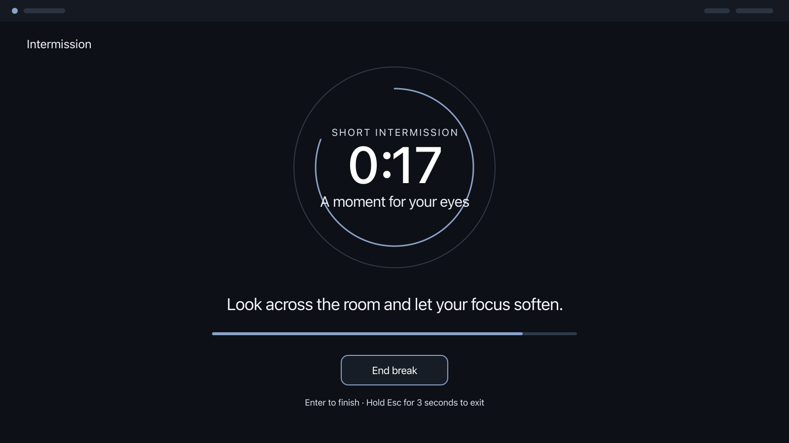

# Intermission

[](https://github.com/AndyBoWu/Intermission/actions/workflows/ci.yml)

A calm, idle-aware break coach for Omarchy Quattro.

Intermission counts active use instead of wall-clock time, recognizes natural
breaks, and can place a clear pause surface on every display when a reminder
becomes due. It stays local, has no account or network service, and always
provides an immediate way back to the desktop.



> The repository is currently private. Installation requires GitHub access
> until the owner makes a separate visibility decision.

## Requirements

- Omarchy with the Quattro shell plugin system
- Git access to this repository
- no additional runtime packages or background services

Plugins run inside the long-lived shell process and are not sandboxed. Review
the source before enabling any third-party plugin.

## Install

With SSH access to the private repository:

```sh
omarchy plugin add git@github.com:AndyBoWu/Intermission.git --enable
```

If the repository is made public later, HTTPS installation can be used:

```sh
omarchy plugin add https://github.com/AndyBoWu/Intermission.git --enable
```

The plugin adds one Intermission chip to the configured bar section. No user
configuration is overwritten without the normal Omarchy enable/save flow.

## Use

- Select the bar chip to open controls and settings.
- Start, pause, resume, begin a break, defer, or skip from the panel.
- A due break opens on every connected display. Only the focused display owns
  keyboard focus.
- Use the visible **End break** control, press Enter on that control, or hold
  Escape for the configured safety interval to exit.
- Qualifying idle time can satisfy a pending break without showing a stale
  overlay when activity resumes.
- A due break can wait through stay-awake mode, focused fullscreen work, or an
  app ID you explicitly select. The bar keeps postponed rest visible.
- Break guidance can use any ordered subset of the built-in eye, standing,
  stretching, and hydration prompts, plus up to eight concise custom items.
- Optional local-time reminder hours freeze automatic timing outside the
  selected window. An end-of-day prompt can wait, stop for today, or continue
  only the current cycle.
- Optional private history shows today plus a rolling 7- or 14-day summary
  without tracking applications or raw activity.

## Configure

Open the bar panel, change the settings, then select **Save changes**. Named
cadence presets update both work intervals, both break durations, and the
short-cycle count together; changing one of those values creates a custom
rhythm.

Defaults:

| Setting | Default |
| --- | ---: |
| Work before a short break | 20 minutes |
| Work before a long break | 20 minutes |
| Short break | 20 seconds |
| Short cycles before a long break | 4 |
| Long break | 3 minutes |
| Advance warning | 30 seconds |
| Quick defer | 5 minutes |
| Natural-break idle threshold | 2 minutes |
| Escape hold | 3 seconds |
| Busy-context deferral | On |
| Protected app IDs | None |
| Break rotation | Eyes, stand, stretch, hydrate |
| Custom break items | None |
| Workday reminder hours | Off |
| End-of-day prompt | Off |
| Private local history | Off |
| Insight window | 7 days |

Reduced motion removes Intermission's progress transition. The interface uses
the active Omarchy theme and keeps pointer and keyboard controls available.

Smart timing uses only current local signals. You can disable automatic
context deferral, add the current app ID to an exact-match list, edit or clear
that list, hold reminders for 30 minutes, end the hold early, or choose
**Start now** to take a pending break immediately. A busy context never
discards a break: one bounded owed-rest value remains visible until real or
natural rest pays it down.

Break rotation is an ordered list of exact IDs. Removing a built-in ID excludes
that prompt; custom items receive a visible `custom-N` ID when added. Empty or
invalid rotations fall back to the four built-ins. Custom labels and
instructions are plain local text with strict length limits.

Workday policy uses one local-time window per weekday. Enter
`HH:MM-HH:MM`, use `off` for a day without reminders, and use a range such as
`22:00-06:00` for an overnight window. Outside those hours Intermission
freezes the current automatic cycle and creates no new owed rest. **Continue
this cycle** is a temporary override; it clears when that cycle's break ends.
An invalid daily window saves as `off` so it cannot create an unexpected
reminder period.

Private insights are opt-in. When enabled, the panel shows active minutes,
supportive breaks, deferrals, skips, early exits, adherence, active days, and
forgiving continuity. Completed and natural breaks support adherence; skips
count against it; deferrals and emergency exits remain neutral. Empty days do
not break continuity, and one skip beside a supportive break is forgiven.
Use **Show JSON export** for selectable machine-readable data or call the
service's `exportHistory` IPC method with `{}`. **Reset history** requires a
second press within five seconds and excludes the current cycle's earlier work
without changing its countdown.
If history is enabled during a running cycle, active work from before that
save is excluded, including when the shell restarts before the cycle settles.

The complete field ranges and migration behavior are in
[Runtime and IPC Contracts](docs/Contracts.md).

## Privacy and permissions

Intermission:

- stores settings in the normal Omarchy inline plugin configuration;
- stores one runtime recovery snapshot under the user's XDG state directory;
- optionally stores a bounded local event history under the same XDG state
  directory, disabled by default;
- does not send telemetry or make runtime network requests;
- does not record window titles, typed content, screenshots, audio, camera
  input, or browsing history;
- reads only the current fullscreen flag, Omarchy stay-awake flag, and current
  app ID for an in-memory exact match; it stores the allowlist but not observed
  app IDs or an observation history;
- does not install a system service or request elevated privileges.

Custom instructions and reminder windows stay in that local inline
configuration. Intermission has no task-list or calendar synchronization,
website or app blocking, system locking, or external account integration.

The runtime snapshot contains cadence state, timestamps, one bounded owed-rest
value, an optional manual-hold deadline, and—only for a mid-cycle history
opt-in—one active-work baseline used to exclude earlier work. Its default
location is:

```text
${XDG_STATE_HOME:-~/.local/state}/intermission/session.json
```

When private history is enabled, `history.json` contains only fixed break
outcomes and active-minute settlements when a cycle is stopped, along with
local date keys, scheduled and observed durations, work targets, and fixed
source/reason enums. It retains at
most 30 local days, 2,000 events, and 1 MiB. It never contains observed app
IDs, window titles, processes, typed content, or a raw activity timeline.
Disabling history and saving removes every retained event; an empty versioned
schema shell may remain at:

```text
${XDG_STATE_HOME:-~/.local/state}/intermission/history.json
```

## Recovery

Valid recent snapshots restore the active cadence without counting shell
downtime as active use. An outside-hours snapshot remains frozen across long
closed periods such as a weekend. Expired breaks complete without replaying,
while corrupt, future, or otherwise stale snapshots recover to a safe stopped
state.

If recovery remains unexpected:

1. Disable the plugin.
2. Move `session.json` out of the state directory shown above.
3. Enable the plugin and start a fresh cadence.

The original file can be moved back for diagnosis while the plugin is
disabled. See the [Acceptance Guide](docs/Acceptance.md) for disposable-state
testing instructions.

## Disable or remove

Disable Intermission while keeping its checkout and settings:

```sh
omarchy plugin disable io.github.andybowu.intermission
```

Remove the installed checkout:

```sh
omarchy plugin remove io.github.andybowu.intermission
```

Removal unloads the plugin but intentionally leaves the local recovery
snapshot and any enabled private-history file. Disable private history and save
before removal, or delete/archive those files separately if no local data
should remain.

## Verify

The portable local and static checks are:

```sh
npm test
npm run test:static
npm run audit:release
npm run lint:workflows
```

Run the complete portable gate with:

```sh
npm run check:portable
```

The remaining checks require an Omarchy/Quickshell development environment:

```sh
npm run lint:qml
npm run test:shell
npm run test:compatibility
npm run test:live
```

`test:compatibility` runs the real Omarchy manifest validator and strict QML
import/type lint, then proves that a missing manifest entry point and a broken
QML import both fail. GitHub Actions runs the same suite against a frozen
required baseline on pull requests and against the current Omarchy `quattro`
branch on a weekly/manual canary.

`lint:workflows` requires Docker. It runs immutable actionlint and zizmor
images against the workflow and Dependabot configuration without granting a
GitHub token or allowing the analyzers to make network requests.

Run the live test only from an Omarchy session where this checkout is already
installed and enabled. Current release evidence and environment limits are
recorded in [Release Evidence](docs/ReleaseEvidence.md).

## Documentation

- [Runtime and IPC Contracts](docs/Contracts.md) — settings, state, recovery, and commands
- [Acceptance Guide](docs/Acceptance.md) — local checks, live scenarios, and visual evidence
- [Automation Security](docs/AutomationSecurity.md) — CI ownership, suppressions, and launch settings
- [Repository Governance](docs/Governance.md) — protected-main policy, merge path, and bypass review
- [Release Process](docs/Releasing.md) — deterministic assets, dry runs, and the owner-gated tag workflow
- [Contributing](CONTRIBUTING.md) — local validation and the required pull-request workflow
- [Marketplace Checklist](docs/MarketplaceChecklist.md) — owner-gated publication preparation

## License

[MIT](LICENSE) © 2026 Andy Wu.
